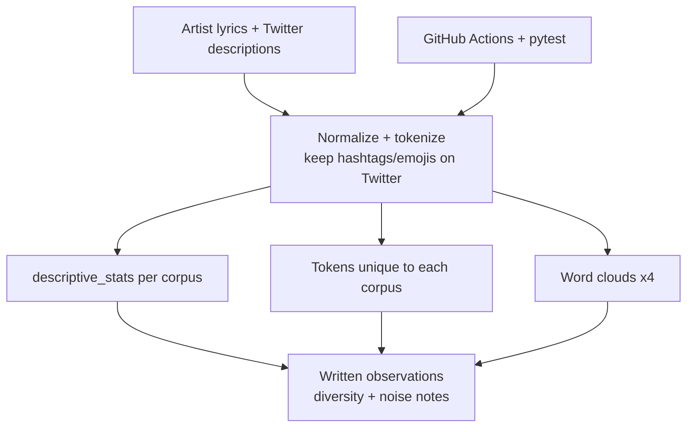
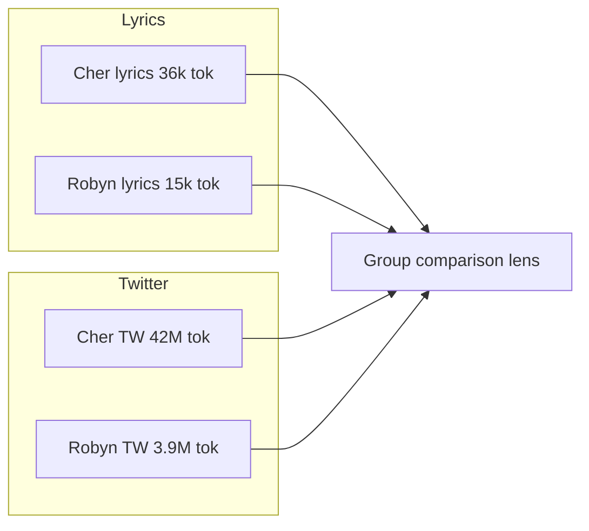

# Lyrics Tokenization & Group Comparison

### Cher vs Robyn lyrics + Twitter bios — tokenization, lexical stats, unique tokens, word clouds

[](https://github.com/ArchanaChetan07/Lyrics-Tokenization-Analysis/actions/workflows/ci.yml)
[](https://www.python.org/)
[](Group%20Comparison.ipynb)
[](tests/test_lyrics.py)

ADS 509 Module 3 notebook that normalizes and tokenizes **lyrics** and **Twitter description** text for two artists (**Cher**, **Robyn**), computes descriptive corpus statistics, isolates tokens unique to each corpus, and builds word clouds — a classic **group-comparison NLP** workflow used in product/research text analytics.

---

## Impact Snapshot

| Corpus | Total tokens | Unique tokens | Lexical diversity | Top tokens |
|---|---:|---:|---:|---|
| Cher lyrics | **35,916** | **3,703** | **0.103** | love, im, know, dont, youre |
| Robyn lyrics | **15,227** | **2,156** | **0.142** | know, dont, im, love, got |
| Cher Twitter | **42,408,074** | **10,713,965** | **0.253** | numeric noise + love |
| Robyn Twitter | **3,888,557** | **1,143,309** | **0.294** | numeric noise + music |

Source: executed outputs in `Group Comparison.ipynb`.

| Delivery | Value |
|---|---|
| Analyses | tokenize/normalize · descriptive stats · unique corpus tokens · word clouds ×4 |
| Tests | **8** pytest cases (splitting, frequency, overlap, sentiment keywords) |
| Deps | pandas, NLTK, wordcloud, emoji, scikit-learn |

---

## Lexical Diversity Comparison

```mermaid
xychart-beta
    title Lexical diversity (unique / total tokens)
    x-axis [Cher_lyrics, Robyn_lyrics, Cher_Twitter, Robyn_Twitter]
    y-axis "Diversity" 0 --> 0.35
    bar [0.103, 0.142, 0.253, 0.294]
```

**Reading the chart:** lyrics are repetitive (low diversity). Twitter corpora are larger/more diverse but contaminated by numeric tokens — a reminder to filter metadata before semantic claims.

---

## Architecture





---

## Engineering Skills Demonstrated

Python · Jupyter · NLP preprocessing · tokenization · NLTK · emoji handling · pandas · Counter-based corpus stats · lexical diversity · word clouds · comparative text analytics · pytest · GitHub Actions

---

## Quick Start

```bash
git clone https://github.com/ArchanaChetan07/Lyrics-Tokenization-Analysis.git
cd Lyrics-Tokenization-Analysis

python -m venv .venv
source .venv/bin/activate   # Windows: .venv\Scripts\activate
pip install -r requirements.txt

jupyter notebook "Group Comparison.ipynb"
pytest tests/ -q
```

---

## Project Structure

```text
├── Group Comparison.ipynb   # full assignment notebook + executed stats
├── requirements.txt
├── tests/test_lyrics.py
└── .github/workflows/ci.yml
```

---

## Design Notes

1. Token-level group comparison is a building block for brand voice, content moderation diffs, and survey free-text splits.
2. High Twitter token counts include digit-heavy noise — production pipelines should strip IDs/timestamps before diversity claims.
3. Tests validate tokenization helpers conceptually; they do not re-download artist corpora in CI.

---

## Future Work

- Add stopword/number filters and recompute diversity
- TF-IDF / log-odds unique token ranking in place of the custom score
- Package `descriptive_stats` into an importable module with CLI

---

## License

See repository license file if present. Course materials remain subject to original ADS 509 terms.
