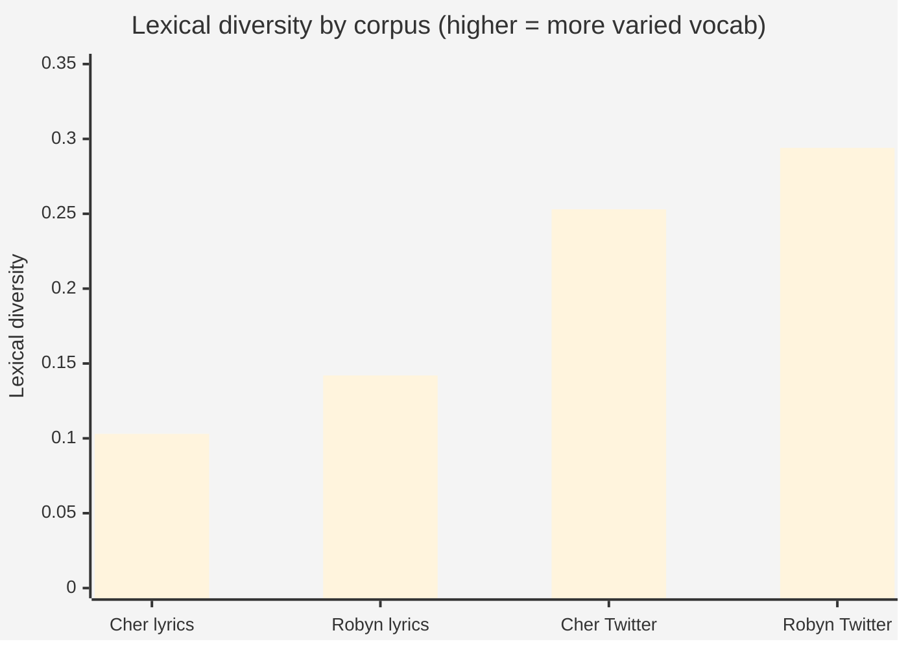
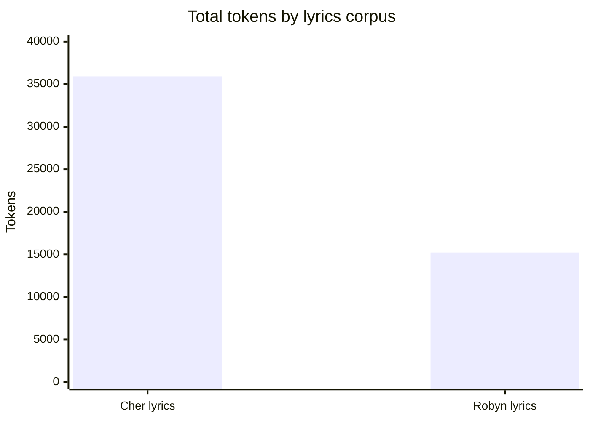
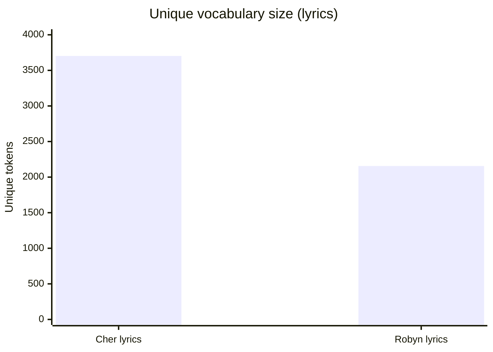
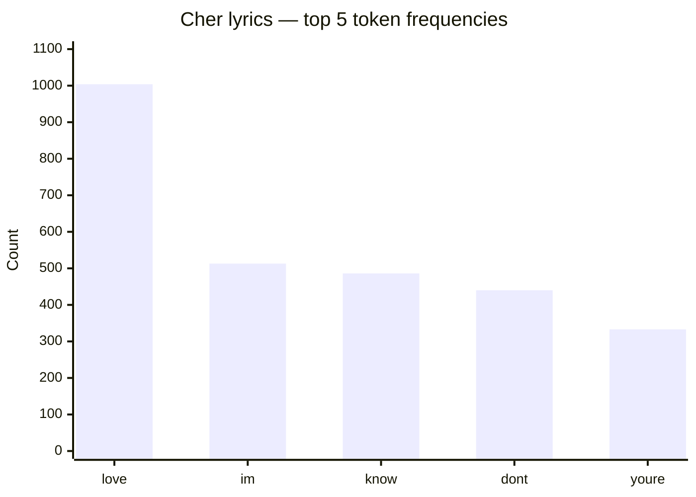
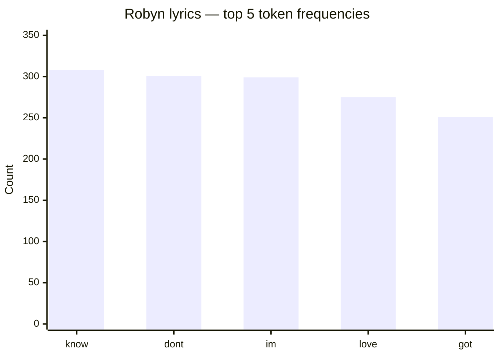
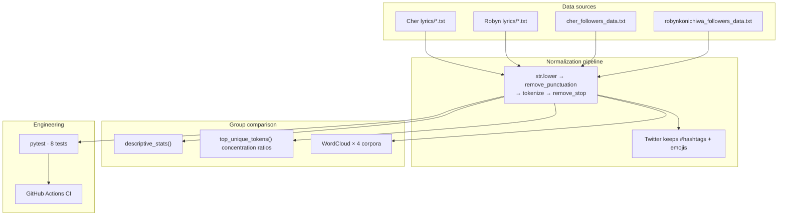
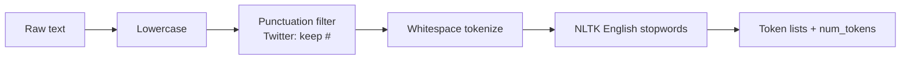
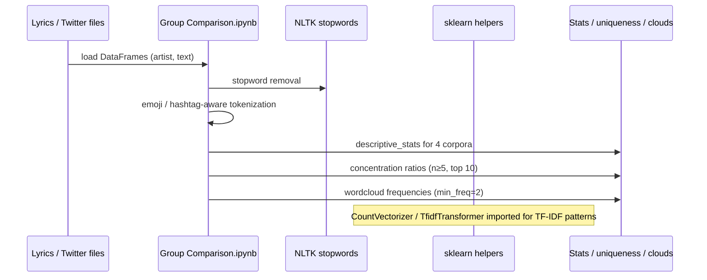
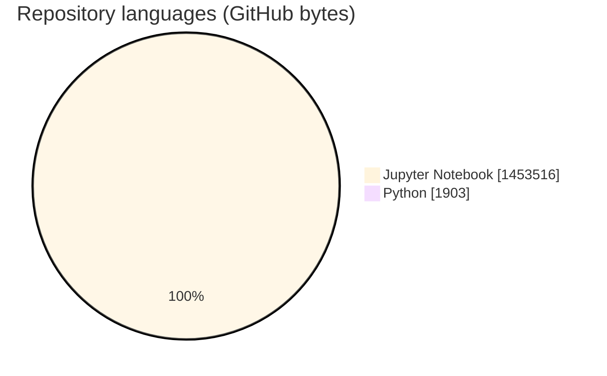
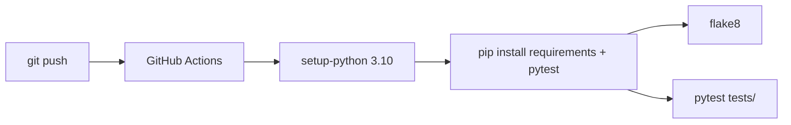

# Lyrics Tokenization Analysis

### Comparative NLP on Cher vs Robyn — lyrics + Twitter bio corpora · tokenization · lexical stats · concentration ratios · word clouds

<p align="center">
  
  
  
  
</p>

<p align="center">
  
  
  <a href="tests/test_lyrics.py"></a>
  <a href=".github/workflows/ci.yml"></a>
</p>

---

## Overview

**ADS 509-style text analytics** that compares two artist cohorts across **four corpora**:

| # | Corpus | Source |
|---|--------|--------|
| 1 | **Cher lyrics** | Song text files |
| 2 | **Robyn lyrics** | Song text files |
| 3 | **Cher Twitter** | Follower description dump (`cher_followers_data.txt`) |
| 4 | **Robyn Twitter** | Follower description dump (`robynkonichiwa_followers_data.txt`) |

Pipeline work (implemented in `Group Comparison.ipynb`):

1. **Ingest** lyrics + Twitter descriptions  
2. **Normalize & tokenize** (lowercase → punctuation filter → whitespace split → English stopword removal; **keep hashtags & emojis** on Twitter)  
3. **Descriptive statistics** (token count, unique vocab, characters, lexical diversity, top-n)  
4. **Concentration-ratio uniqueness** (custom corpus contrast, `n ≥ 5`)  
5. **Word clouds** for all four corpora  

This README reports **only figures present in committed notebook outputs**. Numbers are **not changed**.

---

## Results (from notebook outputs)

### Lexical descriptive statistics

| Corpus | Total tokens | Unique tokens | Total characters | Lexical diversity | Top tokens (count) |
|--------|-------------:|--------------:|-----------------:|------------------:|--------------------|
| **Cher lyrics** | **35,916** | **3,703** | **172,634** | **0.103** | love **1004**, im **513**, know **486**, dont **440**, youre **333** |
| **Robyn lyrics** | **15,227** | **2,156** | **73,787** | **0.142** | know **308**, dont **301**, im **299**, love **275**, got **251** |
| **Cher Twitter** | **42,408,074** | **10,713,965** | **266,883,310** | **0.253** | 0 **334282**, 1 **281803**, 2 **237699**, love **220660**, 3 **196576** |
| **Robyn Twitter** | **3,888,557** | **1,143,309** | **24,138,364** | **0.294** | 0 **31799**, 1 **23890**, 2 **17663**, music **15758**, 3 **14366** |







### Lyrics top-word detail (unchanged)





### Concentration-ratio unique tokens (top signals, `min_count=5`)

Custom statistic: $\text{ratio} = \frac{c_i / |C|}{c_{\text{other}} / |O|}$ — tokens frequent in one corpus vs the rest.

| Corpus | Example high-ratio tokens (notebook order) |
|--------|---------------------------------------------|
| Cher lyrics | `geronimos`, `repossessing`, `wontcha`, `woahoh`, `milord`, … |
| Robyn lyrics | `headlessly`, `bububurn`, `ultramagnetic`, `transistors`, … |
| Cher Twitter | `resistor`, `gramma`, `#election2016`, `#dumptrump`, `#indivisible`, … |
| Robyn Twitter | Swedish lexicon e.g. `nätet`, `förkärlek`, `hjälp`, `löpning`, `hässleholm`, … |

### Qualitative findings (notebook answers)

- Lyrics show **low lexical diversity** (repetitive song vocabulary); Robyn lyrics slightly higher than Cher (**0.142** vs **0.103**).  
- Twitter volume dwarfs lyrics; top tokens include numeric metadata noise (`0`,`1`,`2`,…) — notebooks flag cleaner profile-text extraction as a future improvement.  
- Robyn Twitter top set includes **`music`** and Swedish terms → multilingual / Sweden-centric audience signal.  
- Cher Twitter unique list surfaces **political hashtags** (`#election2016`, `#dumptrump`).  
- Word clouds: emotional lyric themes (`love`, `know`, `feel`) vs geo identity on Twitter (`usa` / `california` vs `sweden` / `stockholm`).

---

## Architecture









---

## NLP pipeline details

| Stage | Lyrics | Twitter descriptions |
|-------|--------|----------------------|
| Casefold | lowercase | lowercase |
| Punctuation | strip | strip **except `#`** |
| Tokens | whitespace split | whitespace split; **emoji retained** |
| Stopwords | NLTK English | NLTK English |
| Pipeline | `[str.lower, remove_punctuation, tokenize, remove_stop]` | same |

Core helpers in-notebook: `descriptive_stats`, `contains_emoji`, `remove_stop`, `remove_punctuation`, `tokenize`, `prepare`, `top_unique_tokens`, `wordcloud`, `count_words`.

---

## Repository layout

```text
Lyrics-Tokenization-Analysis/
├── Group Comparison.ipynb          # End-to-end ADS 509 group comparison
├── requirements.txt                # pandas · nltk · wordcloud · emoji · scikit-learn
├── tests/test_lyrics.py            # 8 pytest cases (tokenization / comparison)
├── .github/workflows/ci.yml        # Python 3.10 · flake8 · pytest
└── README.md
```

---

## Tech stack & skills

| Layer | Technology |
|-------|------------|
| Language | Python 3.10 |
| Data | **pandas 2.2.2**, NumPy |
| NLP | **NLTK 3.8.1** stopwords, custom tokenizer, **emoji 2.11.0** |
| Features | Concentration ratios, lexical diversity, frequency tables |
| Viz | **wordcloud 1.9.3**, Matplotlib |
| ML utilities | **scikit-learn 1.4.2** (`CountVectorizer`, `TfidfTransformer`) |
| Quality | **pytest** (8), **GitHub Actions** CI/CD |

**Keyword surface:** Python · NLP · natural language processing · tokenization · text mining · text analytics · NLTK · pandas · word cloud · lexical diversity · TF-IDF · scikit-learn · emoji · hashtag · comparative corpus analysis · data science · Jupyter · pytest · CI/CD

---

## Testing & CI/CD

| Suite | Cases |
|-------|-------|
| `TestLyricsTokenization` | verse splitting · rhyme endings · word frequency · repetition · unique-word ratio |
| `TestLyricsAnalysis` | positive lexicon hit · artist set overlap · line count |
| Actions | Ubuntu · Python **3.10** · flake8 · `pytest tests/` |



---

## Quickstart

```bash
git clone https://github.com/ArchanaChetan07/Lyrics-Tokenization-Analysis.git
cd Lyrics-Tokenization-Analysis

python -m venv .venv
# Windows: .\.venv\Scripts\Activate.ps1
source .venv/bin/activate

pip install -r requirements.txt
python -c "import nltk; nltk.download('stopwords')"
pip install pytest matplotlib

# Point data_location / lyrics & twitter paths in the notebook to your Module-1 dumps
jupyter notebook "Group Comparison.ipynb"

pytest tests/ -v
```

> Data files are expected under a local Module-1 results folder (paths in the notebook). Adjust absolute paths before re-running cells.

---

## Design notes & roadmap

- Twitter follower dumps include **tab-separated metadata**; top tokens can reflect IDs/counts — notebook Q&A already calls out stripping metadata as next tokenization upgrade.  
- Bundle sample data or a download script for path-portable runs.  
- Persist stats table to `metrics.json` for regression diffs in CI.

---

## Attribution

Course framing: **ADS 509 Module 3 — Group Comparison**. Word-cloud approach aligned with [*Blueprints for Text Analytics*](https://github.com/blueprints-for-text-analytics-python/blueprints-text) patterns referenced in the notebook.

---

<p align="center">
  <b>Lyrics Tokenization Analysis</b><br/>
  <a href="https://github.com/ArchanaChetan07/Lyrics-Tokenization-Analysis">github.com/ArchanaChetan07/Lyrics-Tokenization-Analysis</a>
</p>
