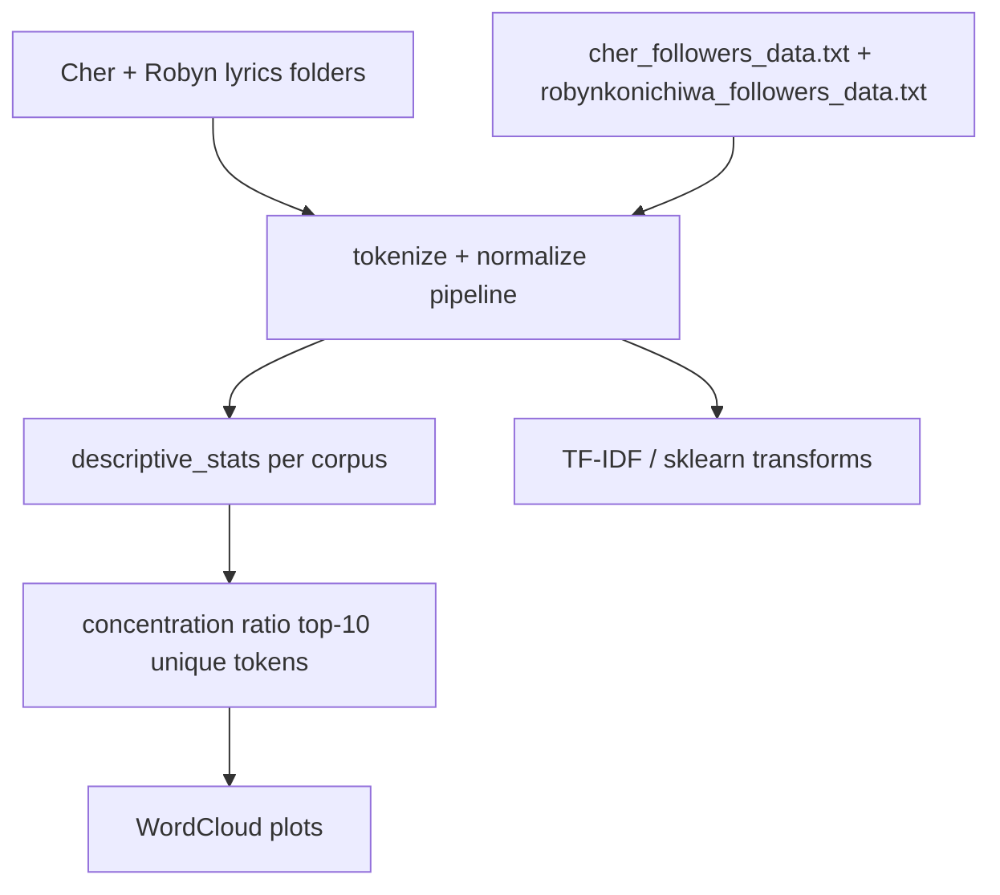

# Lyrics Tokenization Analysis

### Cher vs Robyn lyrics + Twitter follower corpora — tokenization, concentration ratios, word clouds

[](https://github.com/ArchanaChetan07/Lyrics-Tokenization-Analysis/actions/workflows/ci.yml)
[](https://www.python.org/)
[](tests/test_lyrics.py)
[](Group%20Comparison.ipynb)
[](#license)

Single-notebook NLP assignment comparing **Cher** and **Robyn** across four text corpora (lyrics + Twitter follower bios): custom tokenization (keep hashtags/emojis), descriptive stats, concentration-ratio uniqueness, TF-IDF-style analysis, and word clouds. No API, Docker, or Kubernetes deployment in this repo.

---

## Key Results

| Metric | Value | Source |
|---|---|---|
| Notebook cells | **26** | `Group Comparison.ipynb` |
| Artists compared | **2** (Cher, Robyn) | notebook + follower data files |
| Corpora analyzed | **4** (lyrics ×2, Twitter ×2) | notebook sections |
| Cher lyrics tokens | **35,916** (3,703 unique) | notebook `descriptive_stats` output |
| Robyn lyrics tokens | **15,227** (2,156 unique) | same |
| Cher lyrics top token | **love** (1,004) | same |
| Robyn lyrics top token | **know** (308) | same |
| Cher Twitter tokens | **42,408,074** (metadata-heavy) | same |
| Robyn Twitter tokens | **3,888,557** | same |
| Unique-token cutoff | **n ≥ 5** appearances | concentration-ratio section |
| Unit tests | **8** | `tests/test_lyrics.py` |

---

## Architecture



**How it works:** `Group Comparison.ipynb` loads lyrics from per-artist folders and Twitter bios from bundled follower files, applies a pipeline (`lower → remove punctuation → tokenize → remove stopwords`), prints token/unique/lexical-diversity stats, finds corpus-unique tokens via concentration ratios, and renders word clouds. Pytest tests cover rhyme detection, repetition, and sentiment keyword checks on synthetic lyrics.

---

## Tech Stack

| Layer | Choice |
|---|---|
| Language | Python 3.10+ |
| NLP | NLTK stopwords, regex tokenization, emoji handling |
| Data | pandas |
| Viz | WordCloud, matplotlib |
| ML helpers | sklearn `TfidfTransformer` |
| CI | GitHub Actions + pytest |

---

## Installation & Usage

```bash
git clone https://github.com/ArchanaChetan07/Lyrics-Tokenization-Analysis.git
cd Lyrics-Tokenization-Analysis
pip install -r requirements.txt
python -m nltk.downloader stopwords
pytest tests/ -v
jupyter notebook "Group Comparison.ipynb"
```

**Note:** Notebook cells reference local assignment paths for lyrics folders; update `cher_lyrics_path` / `robyn_lyrics_path` to your environment. Bundled Twitter follower files are in-repo.

---

## License

See repository license file if present.
