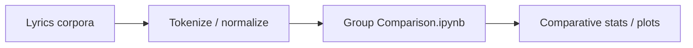
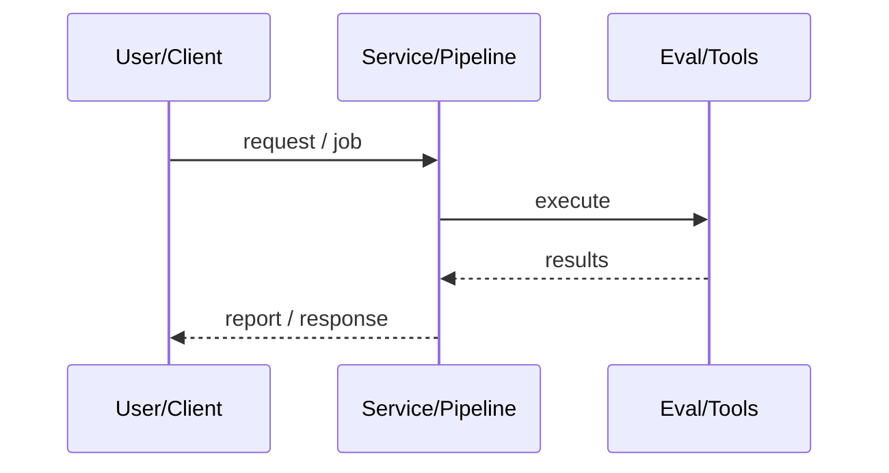
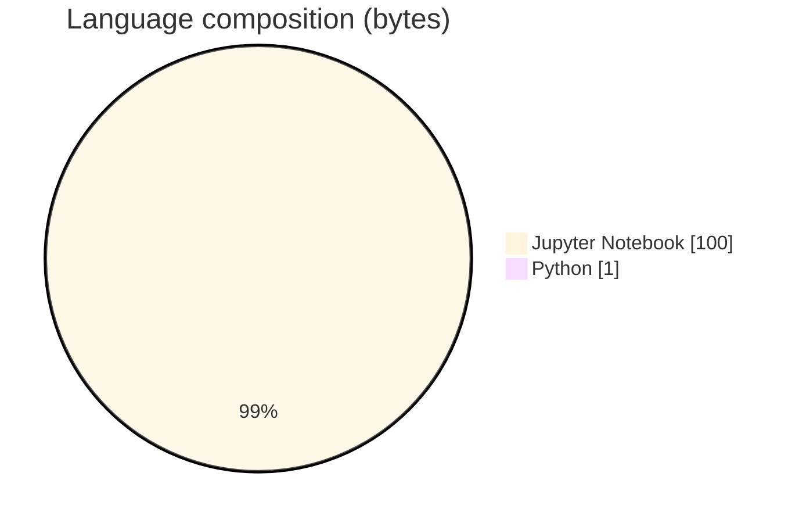

# Lyrics Group Comparison Tokenization Analysis

### ADS-style notebook comparing tokenized lyric groups across artists.

[](https://github.com/ArchanaChetan07/Lyrics-Tokenization-Analysis)
[](https://github.com/ArchanaChetan07/Lyrics-Tokenization-Analysis)
[](https://github.com/ArchanaChetan07/Lyrics-Tokenization-Analysis)
[](https://github.com/ArchanaChetan07/Lyrics-Tokenization-Analysis/actions)

---

## Overview

Compare lexical patterns between artist lyric groups after tokenization/normalization.

Single Group Comparison.ipynb with NLTK/pandas-oriented coursework analysis; requirements pin pandas/nltk-style stack; CI + pytest stub.

Coursework notebook repo for comparative lyrics tokenization analysis.

This repository is maintained as **production-minded portfolio work**: clear architecture, automated checks where present, and metrics that are **traceable to committed artifacts** (never invented).

---

## Architecture

Load artist lyric corpora → tokenize/normalize → compare group descriptive stats/visualizations in notebook.





---

## Results & repository facts

> Only values found in code, configs, tests, or generated reports are listed. Absence of a clinical/ML accuracy number means it was **not** published in-repo.

| Metric | Value | Source |
|---|---|---|
| Tracked repository files | **5** | `git tree` |
| Notebooks | **1** | `Group Comparison.ipynb` |
| Tracked files | **5** | `git tree` |
| Python modules | **1** | `git tree` |
| Test-related paths | **1** | `git tree` |
| CI workflows | **Yes** | `.github/workflows` |
| Docker present | **No** | `repo root` |



---

## Key features

- Group Comparison notebook
- CI workflow

---

## Tech stack

| Layer | Technology |
|---|---|
| language | Python |
| notebooks | Jupyter |
| nlp | NLTK |
| data | pandas |
| ci | GitHub Actions |

---

## Skills demonstrated

Jupyter Notebook · p · a · n · d · s · CI/CD · testing · automation

Keyword surface: **Python · Jupyter Notebook · machine-learning · CI/CD · testing · API · Docker · automation · data-science · software-engineering · system-design · observability · LLM · cloud**

---

## Project structure

```text
Lyrics-Tokenization-Analysis/
├── Group Comparison.ipynb
├── requirements.txt
├── tests/test_lyrics.py
└── .github/workflows/ci.yml
```

---

## Installation & usage

```bash
git clone https://github.com/ArchanaChetan07/Lyrics-Tokenization-Analysis.git
cd Lyrics-Tokenization-Analysis
pip install -r requirements.txt
jupyter notebook "Group Comparison.ipynb"
```

---

## How it works

Open the notebook and run cells to tokenize lyrics and compare groups; external data paths may need local adjustment (common in ADS assignments).

---

## Future improvements

- Bundle or document required lyric/twitter data paths
- Replace spam README with assignment framing

---

## License

See repository.

---

<p align="center">
  <b>Lyrics Group Comparison Tokenization Analysis</b><br/>
  <a href="https://github.com/ArchanaChetan07/Lyrics-Tokenization-Analysis">github.com/ArchanaChetan07/Lyrics-Tokenization-Analysis</a>
</p>
